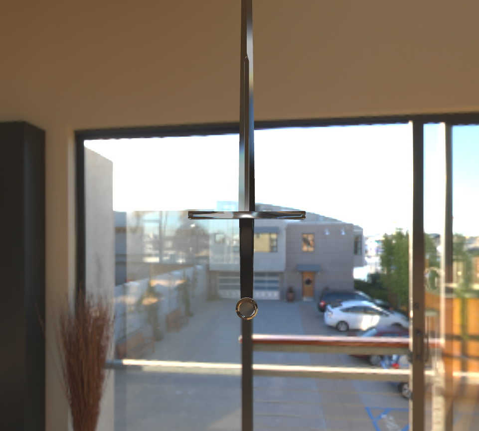

# OpenRender

*A OpenGL Based Render*

## Ref

- JSON reading and analysis: json11
- Model loading: assimp
- Texture Loading: stb
- Math: glm
- Graphics API: OpenGL(GLFW&GLAD)

## External Tools
- cmftStudio for baking default scene radiance and irradiance map

## Current feature

- RHI
- Loading Model & Texture & Material
- Skybox
- PBR&IBL
- Forward Rendering

## Future......

- Deferred Rendering
- Shadow
- Clipping

## Current picture

